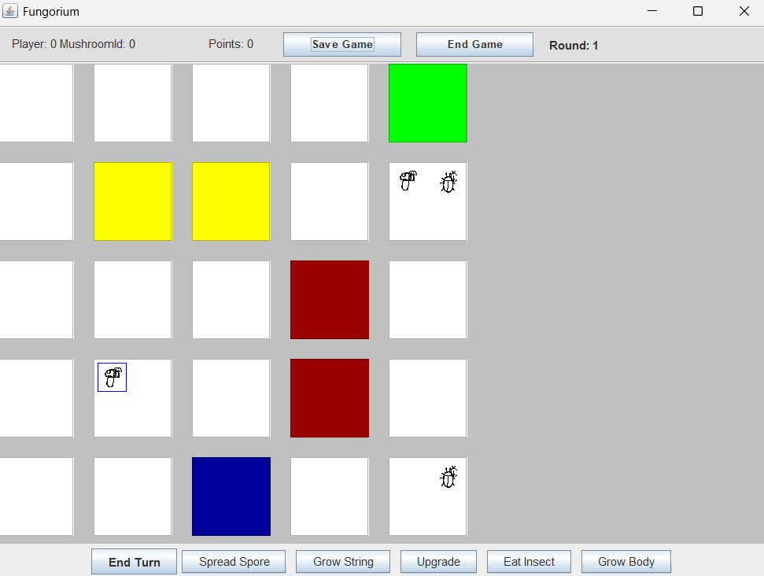
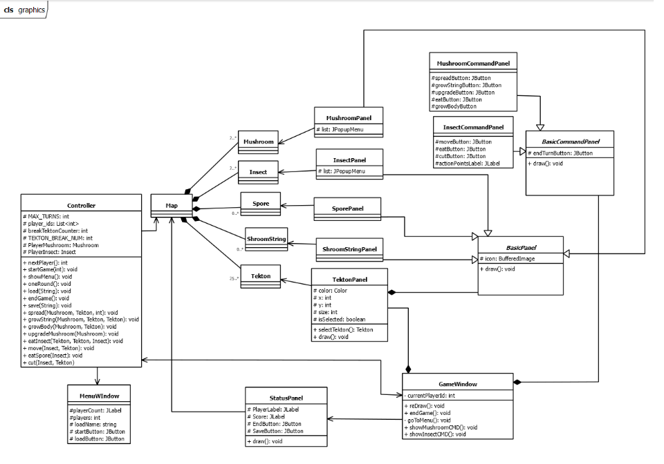

# Fungorium
Fungorium: A Java-Based Strategy Game
Fungorium is a turn-based tactical board game developed as a university group project by Glitchless Group. The game challenges players to survive on a world of shifting tectonic plates, playing as either the expansive Mushroom Growers or the opportunistic Insect Herders.

# Overview
The game takes place on Tectonic Plates (Tektons) that move, merge, or break apart. Players must adapt to the changing environment while managing resources and unit evolution.

# Key Features
Dynamic Environments: Plates can break at any time, requiring constant movement and planning.

Dual Species Mechanics: * Mushroom Growers: Spread fungal networks, shoot spores, and expand across tiles.

Insect Herders: Navigate the mushroom's own network to consume spores and gain nutrients.

Resource System: Units can be upgraded using "Action Points" and nutrients to unlock new abilities.

Custom Map Types: Various tile types including "String-Cutters" and "Killer" spore zones.

# Technical Stack & Tools
Language: Java (JDK 20)

GUI Library: Java Swing

Architecture: Model-View-Controller (MVC)

Version Control: GitHub (Used for branching, merging, and task management)

Design & UML: Gaphor

Assets: Original Pixel Art created via Pixilart

# Project Documentation
The project was managed with a heavy focus on the software development lifecycle:

Skeleton Phase: Core logic and console-based interaction.

Prototype Phase: Implementation of complex game rules and file-based testing.

Graphical Phase: Final UI/UX implementation using Java Swing.
The final codebase consists of over 9,400 lines of code.

# How to Play
# Prerequisites
Java Runtime Environment (JRE) 20 or higher.

# Installation
Clone the repository:
git clone https://github.com/your-repo/fungorium.git

Open the project in IntelliJ IDEA or Eclipse.

Run the Main.java file.

# The Team (Glitchless Group)
Kerekes László

Szemeti Márk

Ostorics Márton Gyula

Király Levente

Nagy Nándor Márton

